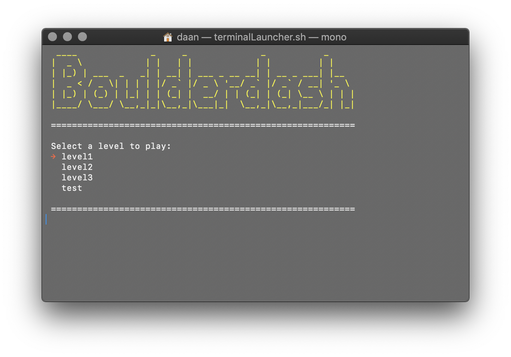
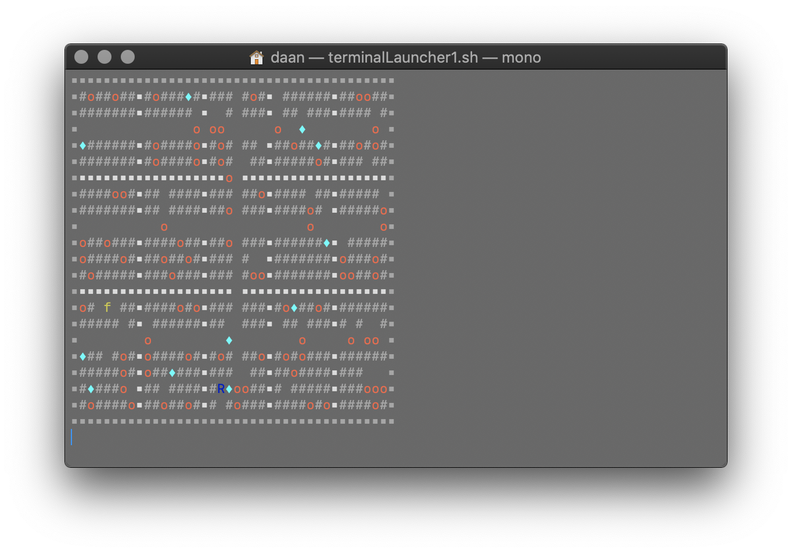

# Boulderdash

Classic game Boulderdash written in C# for a school assignment.

## Getting Started

This project is written with [Rider](https://www.jetbrains.com/rider/) on MacOS, so `parser.cs` has problems with finding your absolute path. Make sure to edit this if you're using this on Windows.

## Running the tests

@todo
 
