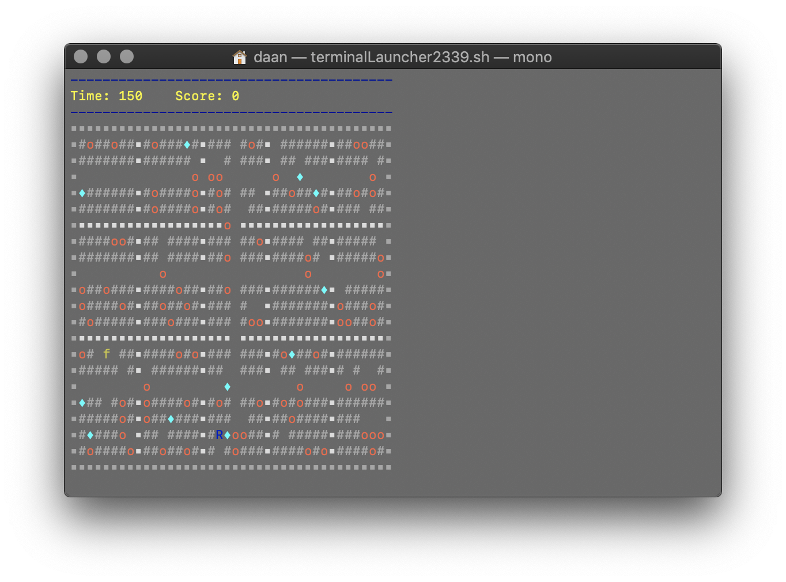

# Boulderdash

Classic game Boulderdash written in C# for a school assignment.

## Getting Started

This project is written with [Rider](https://www.jetbrains.com/rider/) on MacOS, this means if you are running on windows you want to change the paths in `Parser.cs`'s constructor to point to the `levels` directory
 
